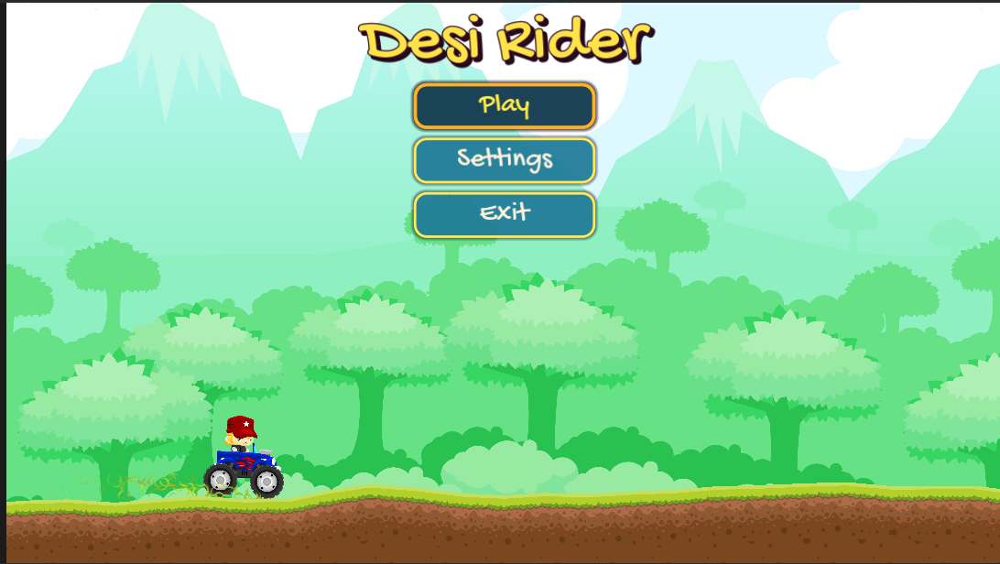
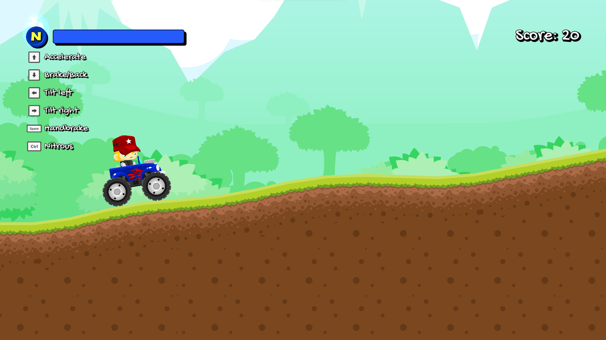
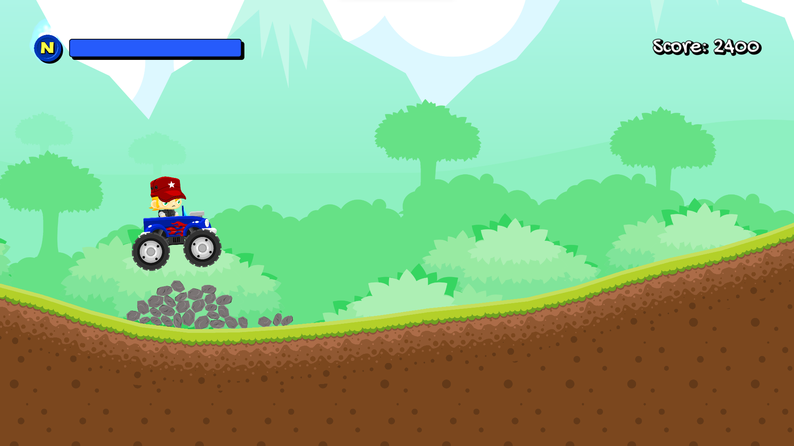
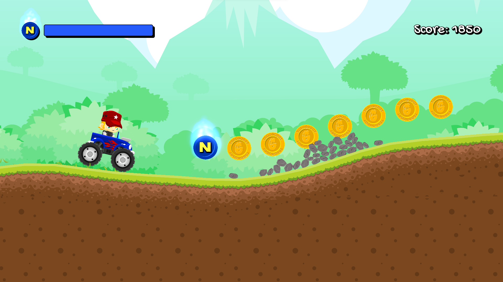

# Desi Rider

# Team Name CABIN

# Members

1. Aniket Patil 124cs0081
2. Sumit Kumar 124cs0085
3. Ankur Dhanraj 124cs0087
4. Lakshya Patidar 524cs0008
   Course project submission built in Godot.

Desi Rider is a 2D physics-based offroad driving game where the player tries to travel as far as possible while collecting score items and managing nitro. The project focuses on core game-programming concepts such as procedural generation, physics interaction, UI state flow, and persistence of player settings.

## Project Overview

- Project type: 2D game development assignment
- Engine: Godot 4.x
- Language: GDScript
- Main scene: `res://gui/main.tscn`
- Core gameplay scene: `res://scenes/game.tscn`

## Learning Goals Demonstrated

- Procedural terrain generation for continuous gameplay
- Rigidbody-based vehicle control and interaction with dynamic ground
- HUD feedback for score and nitro systems
- Pause/settings/game-over UI flow management
- Config save/load for volume, fullscreen, and HDR preferences

## Gameplay Summary

- The vehicle moves over an infinite, procedurally generated terrain
- Score increases with distance and gameplay events
- Nitro is consumable and shown in the HUD
- Game over opens a summary screen with final stats and retry/exit options

## Controls

- Accelerate: Up Arrow or W
- Brake/Reverse: Down Arrow or S
- Tilt Left: Left Arrow or A
- Tilt Right: Right Arrow or D
- Hand Brake: Space
- Nitro: Ctrl
- Pause/Menu: Esc

## Features Implemented

- Main menu with play/settings/exit flow
- In-game HUD with score and nitro meter
- Audio bus separation for music and FX volume control
- Pause menu with resume/settings/surrender/exit actions
- End-of-run game-over summary interface
- Theme and branding customized for this submission

## How to Run

1. Open the project in Godot.
2. Use the default project settings from `project.godot`.
3. Press Play (F5) to run the game.

## Project Structure

- `scenes/`: gameplay scenes and global systems
- `gui/`: menu, HUD, pause, settings, and game-over interfaces
- `items/`: collectible and interactive scene objects
- `particles/`: visual effects scenes
- `assets/`: textures, audio, fonts, and UI art resources
- `translations/`: localization resources

## Screenshots

